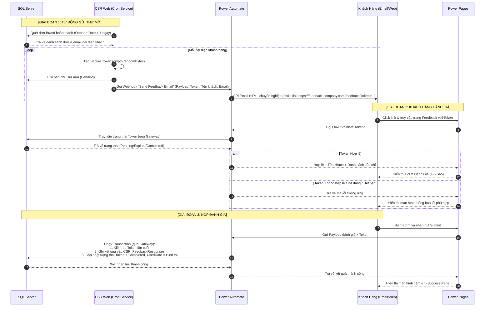

# Tài liệu Thiết kế Giải pháp: Hệ thống Đánh giá Ý kiến Khách hàng (CSR Feedback System)

Tài liệu này mô tả chi tiết kiến trúc, thiết kế cơ sở dữ liệu, quy trình tích hợp và các biện pháp bảo mật cho phân hệ **CSR Feedback** tích hợp giữa hệ thống **CSR Web nội bộ**, **Microsoft Power Pages (Public)** và **Power Automate (Enterprise)** qua **On-premises Data Gateway**.

---

## 1. Kiến trúc Giải pháp (Solution Architecture)

Hệ thống được thiết kế theo mô hình lai (Hybrid), giữ cho cơ sở dữ liệu và API nội bộ hoàn toàn ẩn sau tường lửa doanh nghiệp. Chỉ có cổng thông tin Power Pages được công khai để khách hàng bên ngoài truy cập không cần đăng nhập.

```mermaid
graph TD
    subgraph Môi trường Cloud (Public)
        PP[Power Pages Public Site] -- Clicks Link -- Visitor((Khách Hàng))
        PP -- Gọi API Validate/Submit -- PA[Power Automate Flows]
        PA -- Gửi Mail -- O365[Office 365 Outlook]
    end

    subgraph Môi trường Dong Nghiệp (On-Premises / Private)
        GW[On-premises Data Gateway] <--> DB[(SQL Server)]
        CSR[Internal CSR Web] -- Webhook Trigger -- PA
        CSR <--> DB
    end

    PA <-->|Azure Service Bus Outbound| GW
```

### Nguyên tắc thiết kế:
1.  **Mạng nội bộ riêng tư**: Website CSR Web nội bộ, IIS và SQL Server nằm hoàn toàn trong mạng nội bộ, không mở bất kỳ cổng inbound nào (No Inbound Ports).
2.  **Giao tiếp Outbound**: Mọi tương tác từ Cloud xuống cơ sở dữ liệu on-premises đều đi qua **On-premises Data Gateway** sử dụng các kết nối outbound an toàn thông qua Azure Service Bus.
3.  **Tác vụ Công khai**: Power Pages phục vụ trang đánh giá ẩn danh cho khách ngoài. Token bảo mật được validate trực tiếp thông qua Cloud Flow mà không cần mở kết nối trực tiếp đến API nội bộ.

---

## 2. Biểu đồ Tuần tự (Sequence Diagram)

Quy trình tự động kích hoạt gửi thư mời và quá trình phản hồi ý kiến của khách hàng:



---

## 3. Thiết kế Cơ sở dữ liệu (Database ERD & SQL Scripts)

### Biểu đồ Thực thể Mối quan hệ (ERD Component)
```
  [CSR_Projects] (Project_id)
        │ 1
        ▼ 0..*
  [CSR_FeedbackInvitations] (Id, Token, ProjectId, VisitorId)
        │ 1
        ▼ 0..1
  [CSR_FeedbackResponses] (Id, InvitationId, OverallRating, AnswersJson)
```

### SQL Scripts khởi tạo các bảng liên quan

```sql
USE CSR_DB;
GO

-- 1. Bảng Lời mời Đánh giá (Feedback Invitations)
IF NOT EXISTS (SELECT 1 FROM sys.objects WHERE name = 'CSR_FeedbackInvitations' AND type = 'U')
BEGIN
    CREATE TABLE [dbo].[CSR_FeedbackInvitations] (
        [Id]            INT IDENTITY(1,1)   PRIMARY KEY,
        [Token]         NVARCHAR(128)       NOT NULL UNIQUE, -- Token dài 64+ ký tự
        [ProjectId]     NVARCHAR(100)       NOT NULL,
        [VisitorId]     INT                 NOT NULL,        -- ID đại diện khách (trong JSON GuestReps hoặc liên kết bảng Khách hàng)
        [CreatedDate]   DATETIME            NOT NULL DEFAULT GETDATE(),
        [ExpireDate]    DATETIME            NOT NULL,        -- Hạn sử dụng (ví dụ: +7 ngày)
        [UsedDate]      DATETIME            NULL,            -- Thời điểm nộp feedback
        [Status]        NVARCHAR(50)        NOT NULL DEFAULT N'Pending', -- Pending, Completed, Expired, Cancelled
        [CreatedBy]     NVARCHAR(100)       NULL,
        CONSTRAINT [FK_FeedbackInvitations_Projects] FOREIGN KEY ([ProjectId]) 
            REFERENCES [dbo].[CSR_Projects]([Project_id]) ON DELETE CASCADE
    );
    CREATE INDEX [IX_FeedbackInvitations_Token] ON [dbo].[CSR_FeedbackInvitations]([Token]);
    PRINT 'Created table: CSR_FeedbackInvitations';
END
GO

-- 2. Bảng Lưu kết quả Đánh giá thực tế (Feedback Responses)
IF NOT EXISTS (SELECT 1 FROM sys.objects WHERE name = 'CSR_FeedbackResponses' AND type = 'U')
BEGIN
    CREATE TABLE [dbo].[CSR_FeedbackResponses] (
        [Id]            INT IDENTITY(1,1)   PRIMARY KEY,
        [InvitationId]  INT                 NOT NULL UNIQUE, -- Quan hệ 1-1 với Invitation
        [ProjectId]     NVARCHAR(100)       NOT NULL,
        [OverallRating] INT                 NOT NULL CHECK ([OverallRating] >= 1 AND [OverallRating] <= 5),
        [AnswersJson]   NVARCHAR(MAX)       NOT NULL,        -- Điểm đánh giá chi tiết theo tiêu chí mẫu (JSON format)
        [Comments]      NVARCHAR(1000)      NULL,            -- Bình luận tối đa 1000 ký tự
        [SubmittedAt]   DATETIME            NOT NULL DEFAULT GETDATE(),
        CONSTRAINT [FK_FeedbackResponses_Invitations] FOREIGN KEY ([InvitationId]) 
            REFERENCES [dbo].[CSR_FeedbackInvitations]([Id]) ON DELETE CASCADE,
        CONSTRAINT [FK_FeedbackResponses_Projects] FOREIGN KEY ([ProjectId]) 
            REFERENCES [dbo].[CSR_Projects]([Project_id])
    );
    PRINT 'Created table: CSR_FeedbackResponses';
END
GO
```

---

## 4. Thiết kế API Contracts

### 4.1. Webhook Gọi từ CSR Web lên Power Automate (Send Email)
*   **Method**: `POST`
*   **Protocol**: `HTTPS`
*   **Payload**:
```json
{
  "projectId": "CSR2606001",
  "token": "a1f9c8b7d6e5... (64+ chars)",
  "visitorEmail": "guest.email@client.com",
  "visitorName": "Ms. Katherine Correia",
  "hostName": "Nguyễn Văn A",
  "meetingDate": "02/07/2026",
  "feedbackUrl": "https://feedback.company.com/feedback?token=a1f9c8b7d6e5..."
}
```

### 4.2. API nội bộ Quản lý Feedback (Internal CSR Web API)
*   **GET `/api/feedback/invitations`**: Lấy danh sách thư mời.
    *   *Query params*: `dateStart`, `dateEnd`, `host`, `department`, `visitorName`, `status`.
*   **POST `/api/feedback/invitations/resend`**: Gửi lại thư mời.
    *   *Payload*: `{ invitationId: 123 }`. Logic: gia hạn `ExpireDate` thêm 7 ngày, đổi trạng thái về `Pending`, sinh token mới nếu cần, và kích hoạt lại email gửi.
*   **POST `/api/feedback/invitations/cancel`**: Hủy thư mời chủ động.
    *   *Payload*: `{ invitationId: 123 }`. Logic: Đổi trạng thái sang `Cancelled`.

---

## 5. Thiết kế Quy trình Power Platform (Power Automate & Power Pages)

### 5.1. Thiết kế Power Automate Flows
1.  **Flow 1: Send Feedback Email**:
    *   *Trigger*: HTTP Request received (an toàn bằng Shared Access Signature).
    *   *Action*:
        *   Sử dụng Office 365 Outlook Connector gửi mail HTML chuyên nghiệp.
        *   Nội dung Email sử dụng Template CSS có thương hiệu (Brand colors), hiển thị nút bấm liên kết an toàn.
2.  **Flow 2: Validate Token**:
    *   *Trigger*: Power Pages HTTP Call.
    *   *Action*:
        *   Dùng SQL Server Connector (qua Gateway) chạy stored procedure `usp_ValidateFeedbackToken` nhận vào `@Token`.
        *   Trả về JSON trạng thái: `Status = "Valid"`, `"Expired"`, `"Used"`, hoặc `"Invalid"` kèm thông tin Tên khách và mẫu câu hỏi đánh giá của đơn tiếp khách.
3.  **Flow 3: Save Feedback**:
    *   *Trigger*: Power Pages Form Submit.
    *   *Action*:
        *   Thực hiện kiểm tra Token lần cuối trong Database.
        *   Ghi bản ghi vào bảng `CSR_FeedbackResponses`.
        *   Cập nhật bảng `CSR_FeedbackInvitations` đặt `Status = 'Completed'`, `UsedDate = GETDATE()`.

### 5.2. Thiết kế Cấu hình Power Pages
*   **Site Settings**: Bật quyền truy cập ẩn danh (Anonymous Access) cho trang `/feedback`. Tắt yêu cầu Microsoft/Azure AD Login.
*   **Table Permissions**: Cấp quyền Read và Write đối với bảng thông qua Flow tích hợp. Tuyệt đối không phơi bày quyền đọc/ghi bảng SQL trực tiếp cho Anonymous role. Toàn bộ nghiệp vụ đọc/ghi phải đi qua Power Automate Cloud Flow.
*   **Validation tại Page**:
    *   Trang `/feedback` khi load sẽ thực hiện đọc tham số `token` từ URL.
    *   Nếu rỗng hoặc không đúng định dạng (Regex kiểm tra độ dài và ký tự an toàn), hiển thị cảnh báo lỗi tức thì.
    *   Gọi Flow xác thực. Ẩn form nhập và chỉ hiển thị thông báo lỗi thân thiện nếu token thuộc trạng thái:
        *   Invalid: *"Đường dẫn đánh giá này không hợp lệ."*
        *   Expired: *"Yêu cầu đánh giá này đã hết hạn."*
        *   Completed: *"Bạn đã thực hiện gửi đánh giá trước đó. Xin cảm ơn!"*

---

## 6. Thiết kế Bảo mật và Chống gian lận (Security Design)

*   **Tạo Token bảo mật tuyệt đối**: Sử dụng module `crypto` ở backend CSR Web để sinh mã băm độ dài tối thiểu 64 ký tự (chứa các ký tự ngẫu nhiên mã hóa mạnh, URL safe).
*   **One-time token & Chống Replay Attack**:
    *   Database kiểm tra điều kiện `StatusId` / `UsedDate` trước khi cho phép lưu kết quả đánh giá. 
    *   Ngay khi dữ liệu phản hồi được chèn vào, trạng thái thư mời được chuyển đổi tức thời sang `Completed` trong cùng một Database Transaction để ngăn chặn ghi đè dữ liệu.
*   **Input Sanitization**:
    *   Phần comment/góp ý của khách hàng giới hạn độ dài ở `1000` ký tự tại Client (giao diện nhập liệu) và Server-side validation để tránh tràn bộ đệm (Buffer Overflow) hoặc spam văn bản lớn.
    *   Mã hóa HTML đầu ra trước khi hiển thị bình luận tại trang quản trị để loại bỏ hoàn toàn nguy cơ tấn công XSS (Cross-Site Scripting).
*   **Rate Limiting & Anti-Spam**:
    *   Tích hợp dịch vụ reCAPTCHA ẩn của Google trên trang Power Pages để chặn Bot/Spam tự động điền form.
    *   Giới hạn tần suất gọi API kiểm tra Token của từng IP để phòng chống tấn công dò tìm mã (Brute-force/Enumeration).

---

## 7. Kế hoạch triển khai & Khôi phục (Deployment & Rollback Plan)

### Các bước triển khai (Deployment Guide)
1.  **Cơ sở dữ liệu**:
    *   Chạy SQL Script khởi tạo hai bảng `CSR_FeedbackInvitations` và `CSR_FeedbackResponses` trên SQL Server.
2.  **Cài đặt On-premises Data Gateway**:
    *   Tải lên và cấu hình On-premises Data Gateway trên máy chủ nội bộ.
    *   Cấu hình Connection String tới SQL Server tại Power Platform Admin Center.
3.  **Import Cloud Flows**:
    *   Import 3 Flows Power Automate đã thiết kế vào môi trường Enterprise.
    *   Cấu hình API Webhook URL của Power Automate vào file `.env` của hệ thống CSR Web.
4.  **Triển khai Power Pages**:
    *   Publish site Power Pages, ánh xạ domain an toàn `https://feedback.company.com`.
5.  **Cập nhật ứng dụng CSR Web**:
    *   Cập nhật module tự động hóa (Cron service) quét đơn và trigger webhook gửi thư mời.
    *   Cập nhật giao diện quản lý Feedback History tại trang Dashboard.

### Kế hoạch rollback (Rollback Plan)
*   Nếu có lỗi xảy ra trên luồng Power Pages/Power Automate, tắt cấu hình tự động kích hoạt webhook gửi feedback ở file `.env` của CSR Web (`ENABLE_AUTO_FEEDBACK=false`).
*   Khôi phục cấu hình database bằng cách drop các bảng mới nếu cần thiết (không làm ảnh hưởng đến dữ liệu của bảng `CSR_Projects` do sử dụng khóa ngoại ràng buộc logic).
