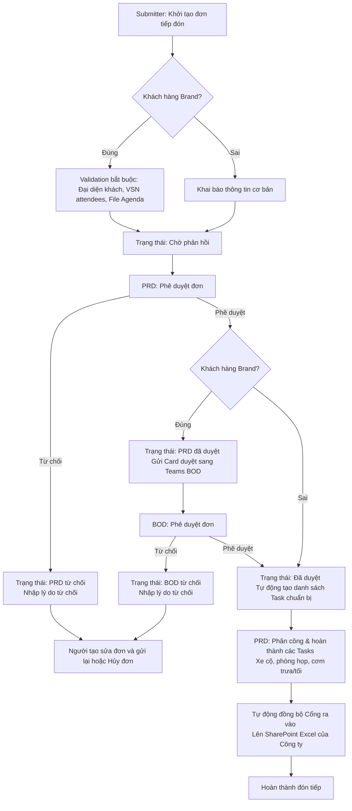

# Quy trình Nghiệp vụ Tổng thể (CSR System Workflow)

Tài liệu này mô tả chi tiết quy trình hoạt động, luồng thông tin tích hợp và cơ chế đồng bộ dữ liệu tự động giữa các cấu phần trong hệ thống Quản lý Tiếp Đón Khách Hàng (CSR Web).

---

## 1. Sơ đồ Quy trình Nghiệp vụ Tổng thể

Dưới đây là luồng xử lý của một đơn đăng ký tiếp đón khách hàng từ khi khởi tạo đến khi kết thúc quá trình tiếp đón thực tế:

---

## 2. Các Luồng Nghiệp vụ Tích hợp Chi tiết

### 2.1. Luồng Tích hợp Phê duyệt qua Microsoft Teams
*   **Trigger**: Khi một đơn tiếp khách loại **Brand** được PRD bấm phê duyệt trên giao diện web, trạng thái đơn chuyển thành `PRD đã duyệt`.
*   **Xử lý ở Backend**:
    *   Hệ thống gọi API của Teams Incoming Webhook gửi một Adaptive Card định dạng JSON tới kênh làm việc của BOD.
    *   Thẻ thông báo chứa đầy đủ thông tin: Mã đơn (ví dụ `CSR2606001`), Người yêu cầu, Tên khách hàng và Chủ đề.
    *   Các nút bấm hành động (Action) trên thẻ:
        *   **Phê duyệt / Từ chối**: Được trỏ trực tiếp về URL của Frontend Web kèm tham số hành động (`/submissions?projectId=CSR2606001&action=approve`).
        *   **Xem chi tiết đơn**: Mở trang web chi tiết đơn tiếp khách tương ứng.
*   **Xác nhận trên Web**:
    *   Khi BOD click vào liên kết Phê duyệt/Từ chối trên Teams, trình duyệt mở trang Frontend của CSR Web.
    *   Hệ thống tự động kiểm tra vai trò đăng nhập của tài khoản. Nếu đúng là BOD, trang web tự động chuyển sang tab **Phê duyệt** và mở Modal phê duyệt/từ chối nhanh.
    *   BOD nhập ý kiến và bấm xác nhận để hoàn tất thao tác trực quan và bảo mật.

### 2.2. Luồng Đồng bộ Ra Vào Cổng lên SharePoint Excel
*   **Mục đích**: Tự động chuyển thông tin biển số xe đăng ký và danh sách khách ra vào cổng lên file Excel quản lý chung của bảo vệ cổng (lưu trữ trên SharePoint).
*   **Trigger**: Được kích hoạt tự động mỗi khi:
    *   Một đơn tiếp khách (không phân biệt loại khách) được duyệt hoàn tất (Status chuyển sang `Đã duyệt` hoặc `BOD đã duyệt`).
    *   Các task liên quan đến lịch trình di chuyển, đón tiếp được chỉnh sửa hoặc phân công lại.
*   **Cơ chế hoạt động**:
    1.  Hệ thống lấy thông tin danh sách xe đi công tác hoặc xe ra vào đăng ký trong các Task di chuyển của từng ngày tiếp đón.
    2.  Gọi Microsoft Graph API truy cập vào file SharePoint Excel chung (`SHAREPOINT_GATE_EXCEL_URL` cấu hình trong `.env`).
    3.  **So khớp cập nhật**: 
        *   Để tránh ghi trùng lặp dữ liệu khi chỉnh sửa đơn nhiều lần, hệ thống thực hiện tìm kiếm dòng cũ trong bảng Excel dựa trên cặp điều kiện khóa: **Cột PROJECT khớp với Mã Đơn Gốc (ví dụ `CSR2606001`) AND Cột Ngày Đến khớp với ngày của lịch trình di chuyển**.
        *   Nếu tìm thấy dòng cũ: Thực hiện gọi API `PATCH` cập nhật đè nội dung mới lên dòng đó.
        *   Nếu không tìm thấy dòng cũ: Thực hiện gọi API `POST` chèn thêm dòng mới vào cuối bảng Excel.

### 2.3. Luồng Gửi Chiến dịch Email Marketing tự động (Campaign Scheduler)
*   **Mục đích**: Tự động gửi email giới thiệu, hướng dẫn hoặc chào mừng tới đoàn khách trước ngày tiếp đón.
*   **Cơ chế hoạt động**:
    *   Một dịch vụ cron job chạy ngầm (`campaignScheduler.js`) được kích hoạt mỗi phút ở Backend.
    *   **Trigger**: Khi thời gian hệ thống đúng **08:00 sáng**.
    *   **Nghiệp vụ**:
        1. Quét database tìm các đơn tiếp khách có Ngày tiếp đón đầu tiên cách ngày hiện tại đúng **7 ngày** (chuẩn bị đón tiếp trước 1 tuần).
        2. Tải danh sách các mẫu email chiến dịch (Email Campaign Templates) đang hoạt động và khớp với cấu hình loại khách hàng/công ty tương ứng.
        3. Sử dụng Microsoft Graph API gửi email hàng loạt tới địa chỉ hòm thư của các đại diện đoàn khách hàng (GuestReps) lấy thông tin từ đơn tiếp đón.
        4. Ghi log lịch sử gửi email thành công hoặc thất bại vào database để phục vụ giám sát.
